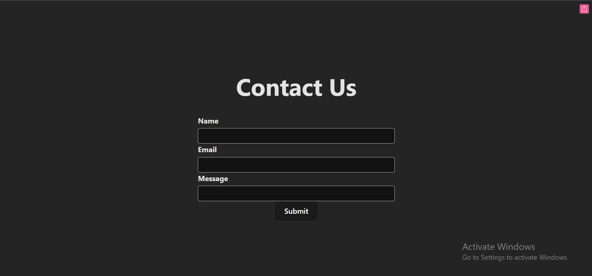
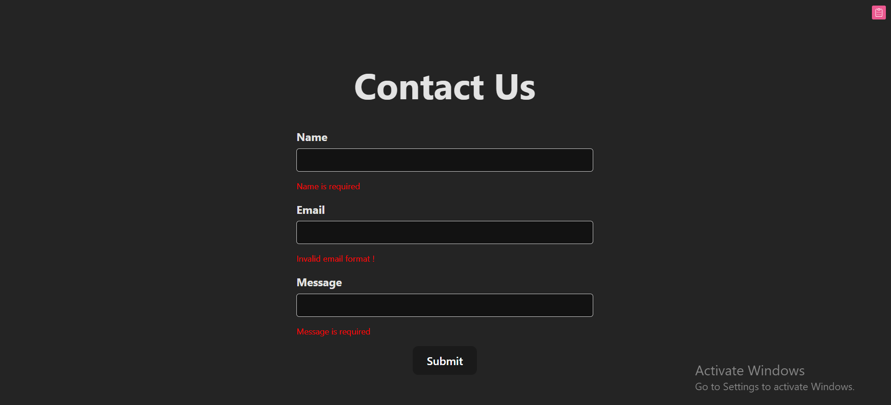
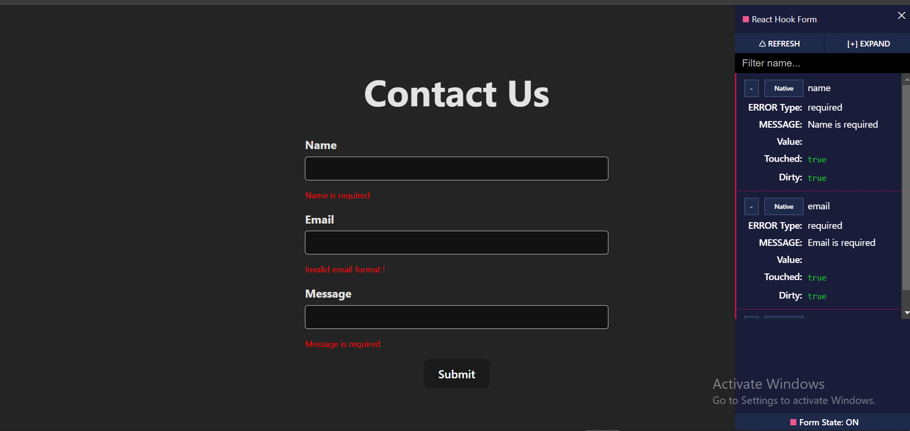
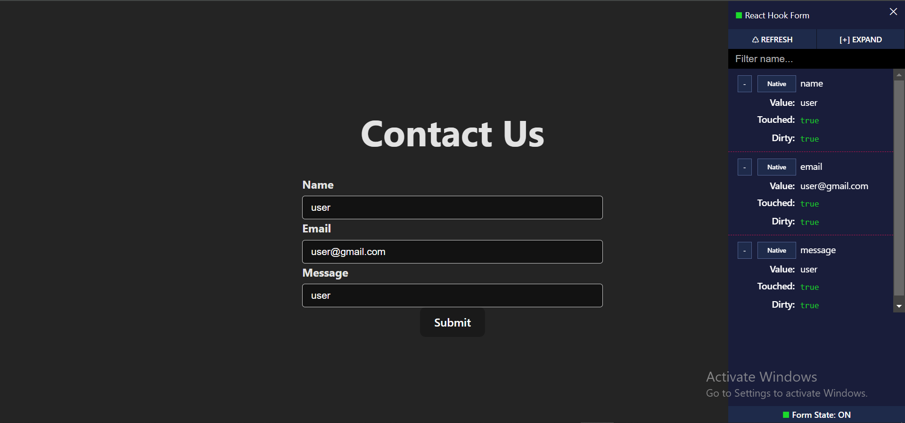

# Contact Us Form

This project is a simple contact form built using React and `react-hook-form` to demonstrate form validation and state management. The form includes fields for Name, Email, and Message, and provides real-time validation feedback to the user. Additionally, the project utilizes `@hookform/devtools` for visualizing form state during development.

## Features

- **Form Validation**: Provides instant feedback for required fields and validates email format.
- **Real-time State Management**: Utilizes `react-hook-form` for managing form state efficiently.
- **DevTools Integration**: Includes `@hookform/devtools` for better development experience.

## Installation

To run this project locally, follow these steps:

1. Clone the repository:
   ```bash
   git clone https://github.com/your-username/contact-us-form.git
   ```
2. Navigate to the project directory:
   ```bash
   cd contact-us-form
   ```
3. Install the dependencies:
   ```bash
   npm install  `
   ```

## Usage

To start the development server, run:
```
npm start
```

 
 
 
<hr>


# React + TypeScript + Vite

This template provides a minimal setup to get React working in Vite with HMR and some ESLint rules.

Currently, two official plugins are available:

- [@vitejs/plugin-react](https://github.com/vitejs/vite-plugin-react/blob/main/packages/plugin-react/README.md) uses [Babel](https://babeljs.io/) for Fast Refresh
- [@vitejs/plugin-react-swc](https://github.com/vitejs/vite-plugin-react-swc) uses [SWC](https://swc.rs/) for Fast Refresh

## Expanding the ESLint configuration

If you are developing a production application, we recommend updating the configuration to enable type aware lint rules:

- Configure the top-level `parserOptions` property like this:

```js
export default {
  // other rules...
  parserOptions: {
    ecmaVersion: 'latest',
    sourceType: 'module',
    project: ['./tsconfig.json', './tsconfig.node.json', './tsconfig.app.json'],
    tsconfigRootDir: __dirname,
  },
}
````

- Replace `plugin:@typescript-eslint/recommended` to `plugin:@typescript-eslint/recommended-type-checked` or `plugin:@typescript-eslint/strict-type-checked`
- Optionally add `plugin:@typescript-eslint/stylistic-type-checked`
- Install [eslint-plugin-react](https://github.com/jsx-eslint/eslint-plugin-react) and add `plugin:react/recommended` & `plugin:react/jsx-runtime` to the `extends` list
